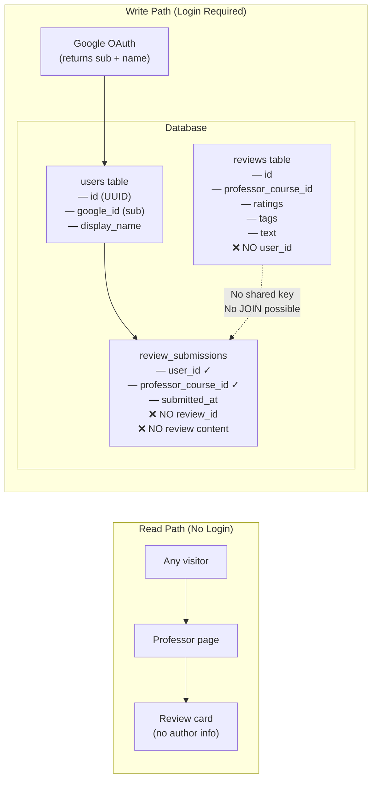
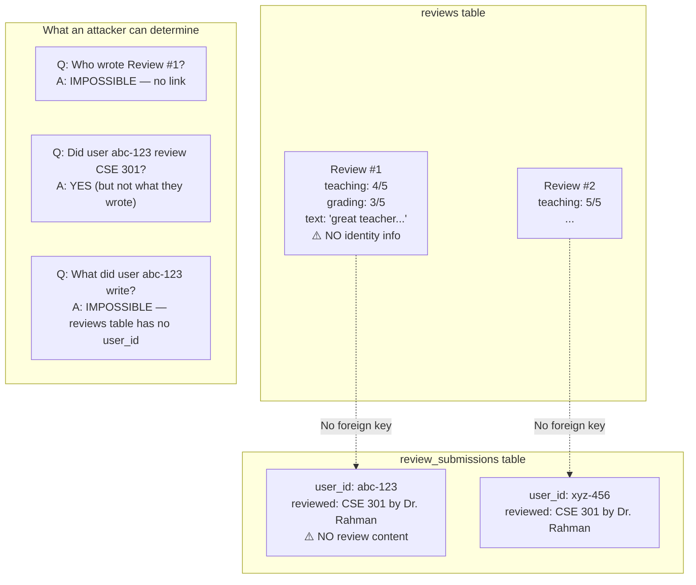
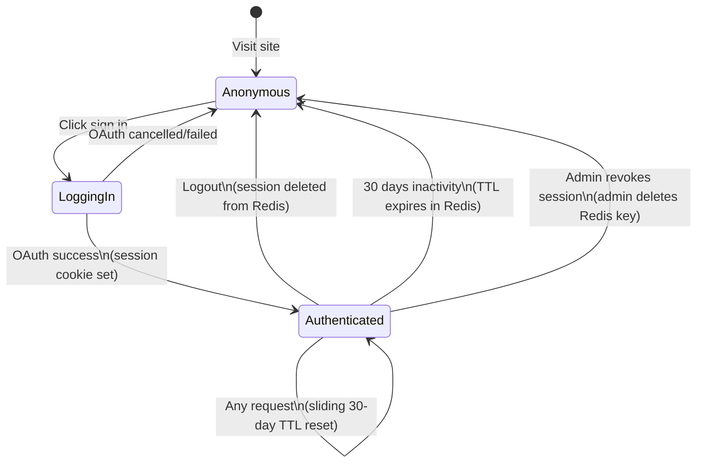

# Auth & Anonymity Flow — Poray Kemon

This document visualizes the core privacy architecture — how login is required but anonymity is preserved.

---

## The Anonymity Contract



---

## What Each Table Knows



---

## Full Authentication Sequence

```mermaid
sequenceDiagram
    actor Student
    participant Browser
    participant NextJS as Next.js Server
    participant Google as Google OAuth
    participant Redis as Redis (Sessions)
    participant Postgres as PostgreSQL

    Note over Student, Postgres: Step 1 — Initiate OAuth

    Student->>Browser: Click "রিভিউ লিখুন"
    Browser->>NextJS: GET /review/new
    NextJS-->>Browser: Redirect to /api/auth/signin (no session)
    Browser-->>Student: Show "সাইন ইন করুন" prompt

    Student->>Browser: Click "Google দিয়ে সাইন ইন করুন"
    Browser->>NextJS: GET /api/auth/signin/google
    NextJS->>Google: Redirect to accounts.google.com\n?client_id=...&state=csrf_token

    Note over Student, Postgres: Step 2 — Google Consent

    Google-->>Student: Google consent screen
    Student->>Google: Approves
    Google->>NextJS: GET /api/auth/callback/google\n?code=AUTH_CODE&state=csrf_token

    Note over Student, Postgres: Step 3 — Token Exchange

    NextJS->>Google: POST /token {code, client_secret}
    Google-->>NextJS: {access_token, id_token}\nid_token contains: sub, name, email, ...

    Note over NextJS: Extract ONLY: sub, name\nDeliberately DROP: email, picture

    Note over Student, Postgres: Step 4 — User Record

    NextJS->>Postgres: INSERT INTO users (google_id=sub, display_name=name)\nON CONFLICT (google_id) DO UPDATE SET last_active=NOW()
    Postgres-->>NextJS: {id: "uuid-1234"}

    Note over Student, Postgres: Step 5 — Session

    NextJS->>Redis: SET session:{random_token}\n{userId: "uuid-1234", displayName: "Sifat"}\nEX 2592000 (30 days)
    NextJS-->>Browser: Set-Cookie: session={random_token}\nhttpOnly; Secure; SameSite=Lax

    Browser-->>Student: Redirected to /review/new\nShows review form

    Note over Student, Postgres: Step 6 — Submit Review

    Student->>Browser: Fills form, clicks submit
    Browser->>NextJS: POST /api/reviews\n{professor_id, course_code, ratings, text, tags}\nCookie: session={random_token}

    NextJS->>Redis: GET session:{random_token}
    Redis-->>NextJS: {userId: "uuid-1234"}

    NextJS->>Postgres: BEGIN TRANSACTION

    NextJS->>Postgres: SELECT FROM review_submissions\nWHERE user_id='uuid-1234'\nAND professor_course_id=42
    Postgres-->>NextJS: 0 rows (not yet reviewed)

    NextJS->>Postgres: INSERT INTO reviews\n(professor_course_id=42, ratings...)\n⚡ NO user_id column
    NextJS->>Postgres: INSERT INTO review_submissions\n(user_id='uuid-1234', professor_course_id=42)
    NextJS->>Postgres: UPDATE professor_courses SET avg_...=running_avg WHERE id=42
    NextJS->>Postgres: COMMIT

    NextJS-->>Browser: 201 {message: "রিভিউ জমা হয়েছে"}
    Browser-->>Student: Success confirmation
```

---

## Session Lifecycle



---

## What is NEVER Stored

| Data                         | Stored?  | Why Not                                                |
| ---------------------------- | -------- | ------------------------------------------------------ |
| Email address                | ❌ Never | Reduces PII; Google sub is sufficient; PDPO compliance |
| IP address                   | ❌ Never | Could identify anonymous reviewers                     |
| Review authorship            | ❌ Never | Core anonymity promise                                 |
| Google profile picture       | ❌ Never | Not needed; reduces PII                                |
| Access token / Refresh token | ❌ Never | Discarded after `sub` extraction                       |
| Review text linked to user   | ❌ Never | Structural impossibility (no shared key)               |
