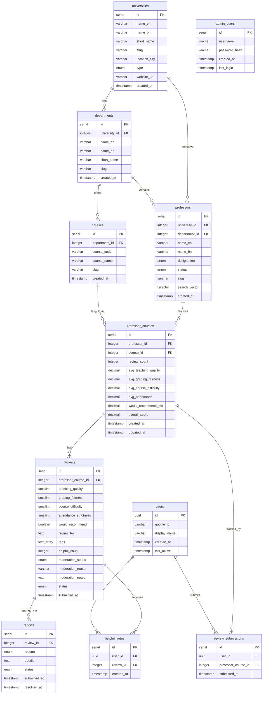

# Entity Relationship Diagram — Poray Kemon



---

## Key Design Notes

### Anonymity by Schema

```
reviews                    review_submissions
───────────────────        ──────────────────────────
id                         id
professor_course_id ───┐   user_id          ← WHO reviewed
teaching_quality       │   professor_course_id ← WHAT they reviewed
...                    │   submitted_at
[NO user_id]           │
                       └── same professor_course_id
                           BUT no shared key with reviews
```

There is no foreign key from `reviews` to `review_submissions`.  
There is no foreign key from `review_submissions` to `reviews`.  
A JOIN across the two tables to find "who wrote this review" is structurally impossible.

### Aggregate Flow

```
New review INSERT
        │
        ▼
professor_courses UPDATE
  review_count + 1
  avg_teaching_quality = running avg
  avg_grading_fairness = running avg
  avg_course_difficulty = running avg
  avg_attendance = running avg
  would_recommend_pct = running pct
  overall_score = weighted composite
```

All in one ACID transaction. O(1) update cost regardless of total review count.
