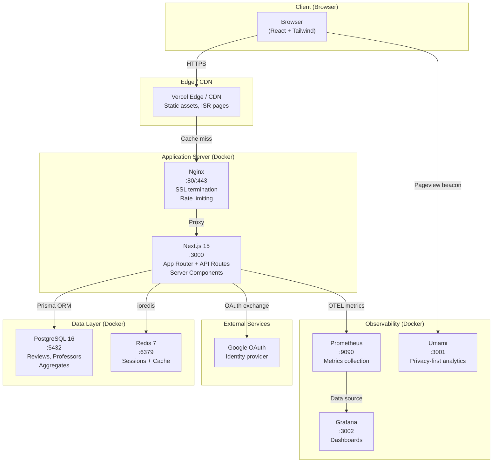
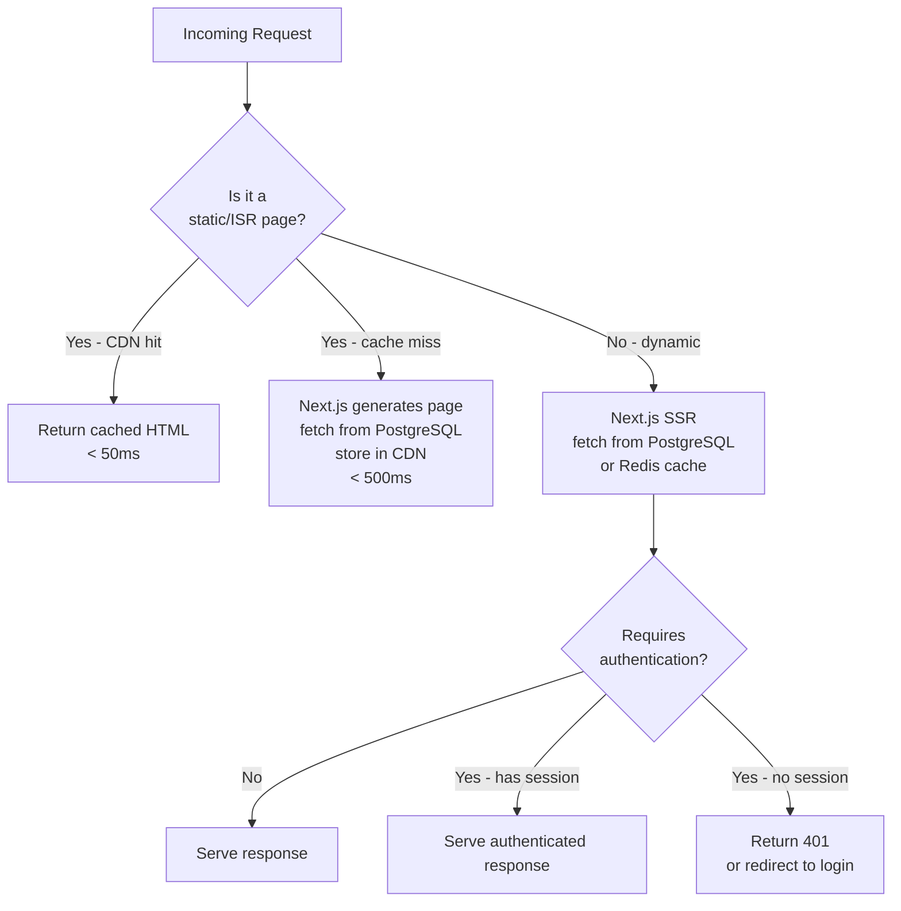
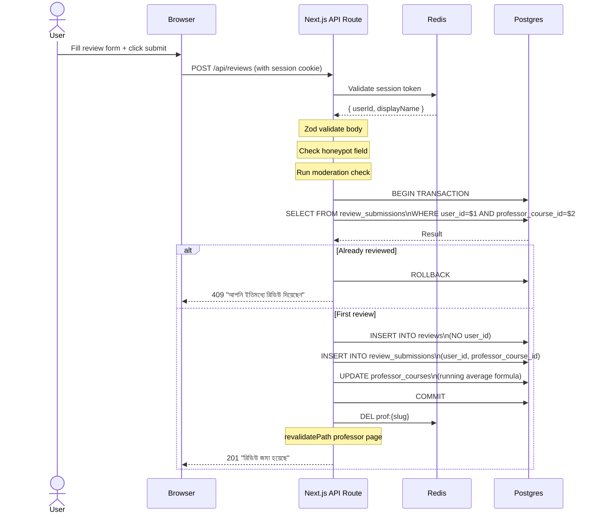
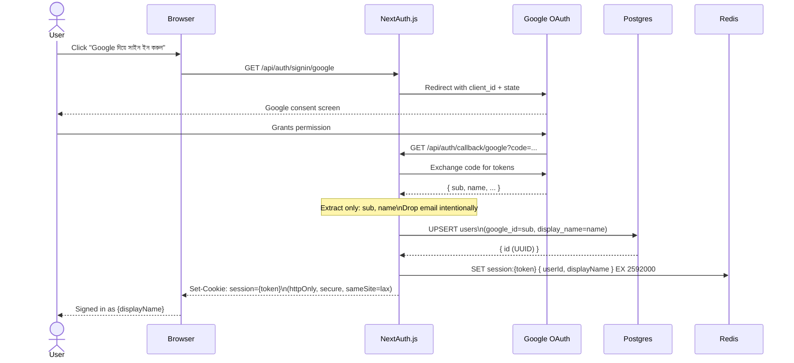
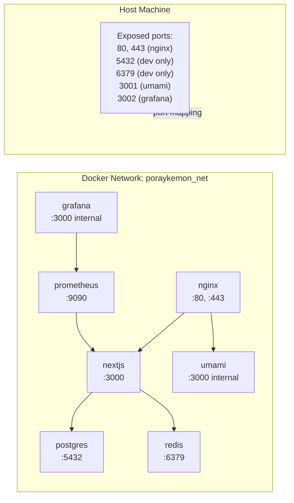
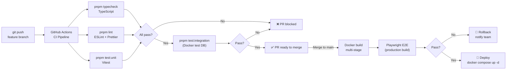

# System Architecture Diagram — Poray Kemon

## High-Level Architecture

---

## Request Flow by Route Type

---

## Review Submission Transaction

---

## Authentication Flow

---

## Docker Compose Network

---

## CI/CD Pipeline

