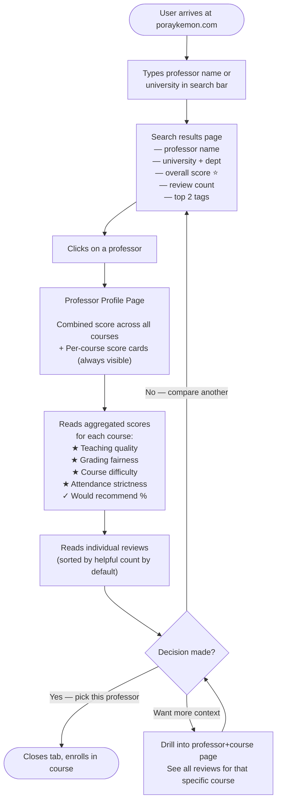
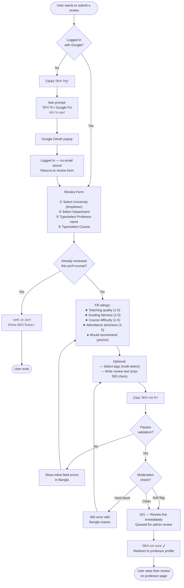
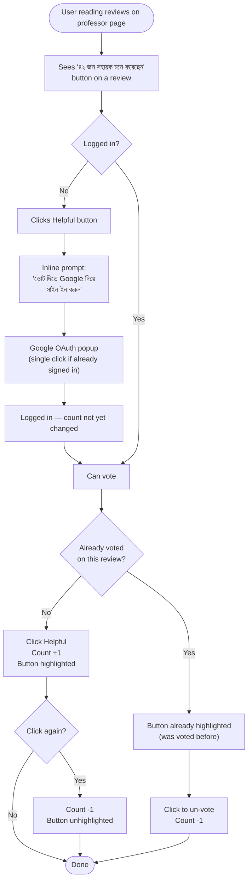
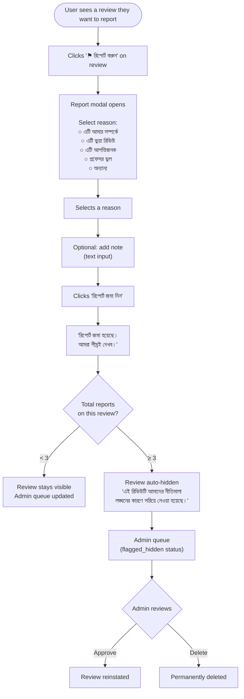
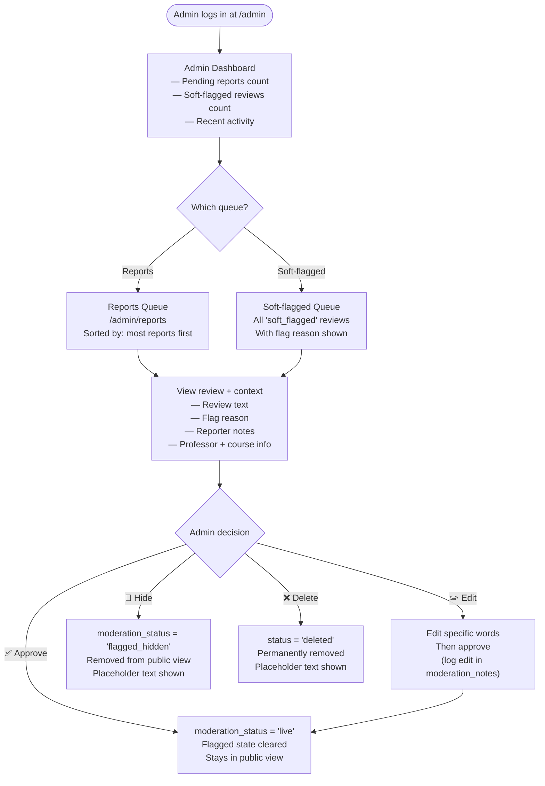

# User Flow Diagrams — Poray Kemon

---

## Flow 1: Course Planner (Read Path)

---

## Flow 2: Review Submission (Write Path)

---

## Flow 3: Helpful Voting

---

## Flow 4: Reporting a Review

---

## Flow 5: Admin Moderation

